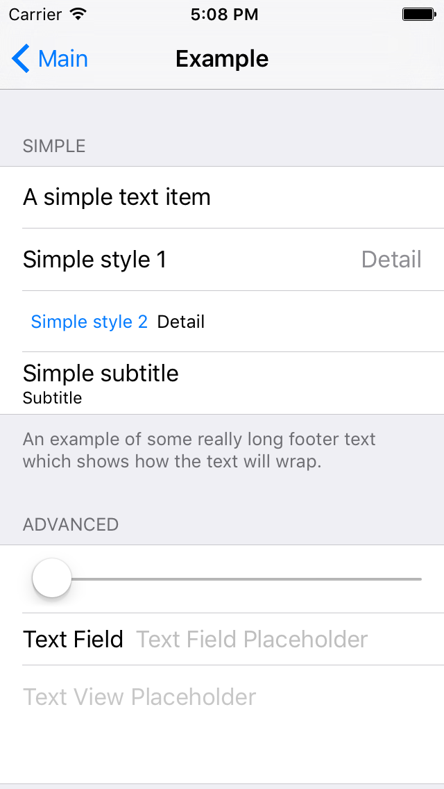

# AST
Provides a simple data model for UITableView contents. The primary use case is to declaratively define a table view.

# Example
```
ASTViewController* readmeExample = [ [ ASTViewController alloc ] initWithStyle: UITableViewStyleGrouped ];
readmeExample.title = @"Example";
readmeExample.data = @[
    @{
        AST_headerText : @"Simple",
        AST_items : @[
            [ ASTItem itemWithText: @"A simple text item" ],
            [ ASTItem itemWithStyle: UITableViewCellStyleValue1
                    text: @"Simple style 1" detailText: @"Detail" ],
            [ ASTItem itemWithStyle: UITableViewCellStyleValue2
                    text: @"Simple style 2" detailText: @"Detail" ],
            [ ASTItem itemWithStyle: UITableViewCellStyleSubtitle
                    text: @"Simple subtitle" detailText: @"Subtitle" ],
        ],
        AST_footerText : @"An example of some really long footer text which shows how the text will wrap.",
    },
    @{
        AST_headerText : @"Advanced",
        AST_items : @[
            [ ASTSliderItem item ],
            [ ASTTextFieldItem itemWithDict: @{
                AST_cell_textLabel_text : @"Text Field",
                AST_cell_textInput_placeholder : @"Text Field Placeholder",
            } ],
            [ ASTTextViewItem itemWithDict: @{
                AST_cell_textInput_placeholder : @"Text View Placeholder",
            } ],
        ],
    },
];

[ self.navigationController pushViewController: readmeExample animated: YES ];
```


# Motivation
Often one wants to be able to quickly define a table with disparate elements. Settings views and login views are common examples. Storyboards provide a way to make static tables but do not have an API to define them in code and there is no way to change the contents later. AST tries to make defining and updating table contents quick and easy.

# Installation
To add AST to your application:

 1. Add the AST repository as a
    [submodule](https://git-scm.com/book/en/v2/Git-Tools-Submodules) of your
    application’s repository.
 1. Drag and drop `AST.xcodeproj` into your application’s Xcode project or workspace.
 1. On the “General” tab of your application target’s settings, add
    `AST.framework` to the “Embedded Binaries” section.

# Documentation
Individual APIs are documented in the headers. General concepts will be outlined here.
Construction APIs typically fall into two categories: explicit and dictionary based. The explicit APIs take a number of specific parameters while the dictionary APIs take a single dictionary with each key value pair representing a configuration parameter.
Definitions for the table contents are meant to be very permissive in the data that they consume. A list of items may contain any combination of specific ASTItem classes or a plain dictionary describing the item or a NSNull instance. NSNull instances in this context are ignored.

#### Dictionaries in Lists
Dictionaries are allowed in lists of items or sections. This allows for table contents to be loaded from files or the internet with a simple, well understood format. In the case of items the dictionary will be used to construct a ASTItem instance unless a different subclass is specified using the AST_itemClass key.

#### NSNull in Lists
NSNull instances are allowed in lists of items or sections to allow for short, inline, runtime decisions about the inclusion of an item. For example:

```
AST_items : @[
	@{
		AST_selectAction : @selector(aboutAction:),
		AST_cell_textLabel_text : @"About",
	},
	@{
		AST_selectAction : @selector(settingsAction:),
		AST_cell_textLabel_text : @"Settings",
	},
	[ prefs boolForKey: @"showDebugSettings" ]
			? @{
				AST_selectActionBlock : @selector(debugSettingsAction),
				AST_cell_textLabel_text : @"Debug Settings",
			}
			: [ NSNull null ],
]
```
This allows a runtime choice to be made without having to resort to adding items to a mutable array.

# Swift
AST is currently written in Objective-C but works well with Swift. All APIs are decorated with Nullability annotations to improve Swift interoperability.

# Contributing

If you are interested in contributing to this project, check out our [contribution guidelines](CONTRIBUTING.md).
